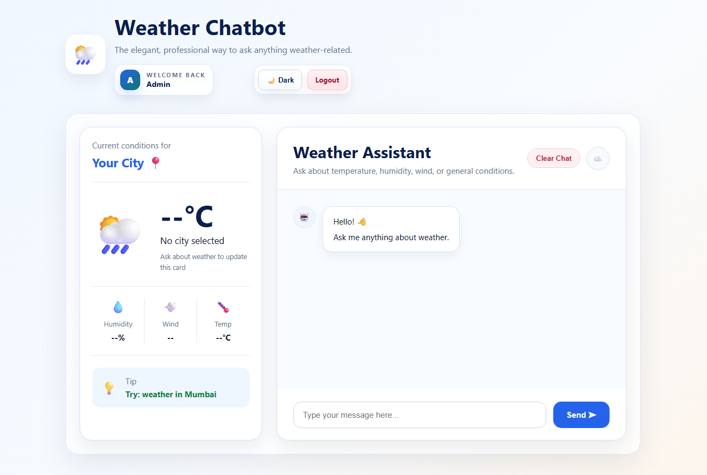
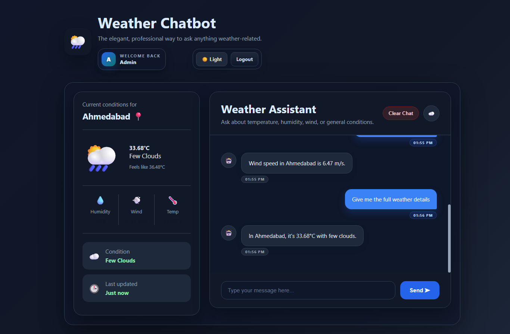
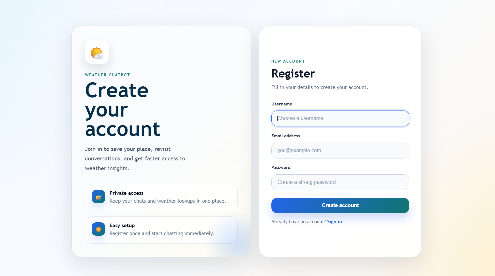
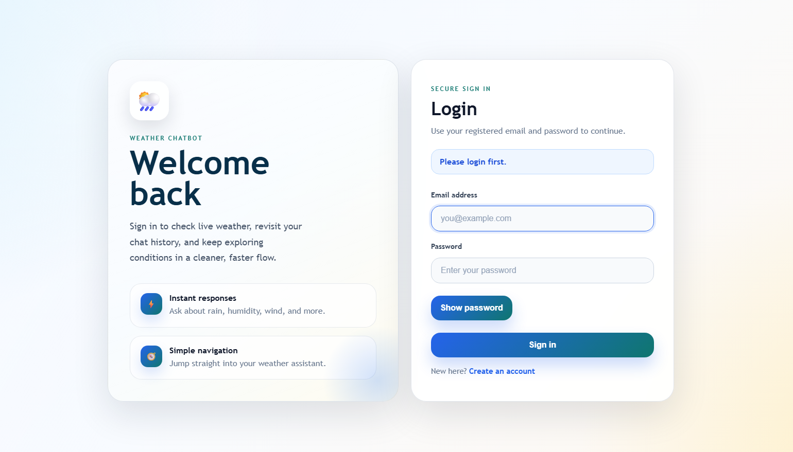
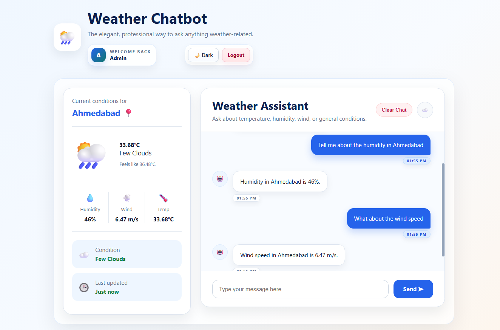
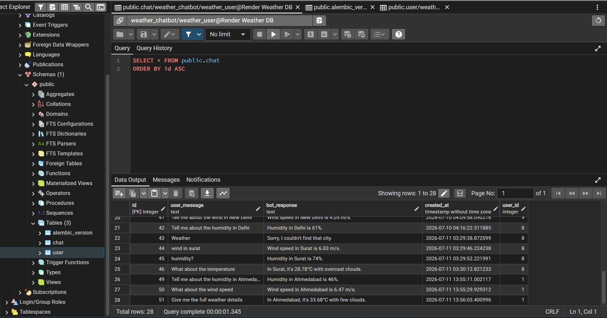

# 🌦️ Weather Chatbot

> A modern full-stack weather chatbot built with **Flask**, **PostgreSQL**, and the **OpenWeather API**, featuring secure authentication, persistent chat history, and a beautiful responsive interface.

<p align="center">
  
  
  
  
  
</p>

---

## 📖 Overview

Weather Chatbot is a full-stack web application that allows users to ask weather-related questions in natural language.

Instead of manually searching for weather information, users can simply type questions like:

> "What's the weather in London?"

or

> "How humid is Mumbai today?"

The chatbot understands the request, fetches live weather data from the **OpenWeather API**, stores conversations in a PostgreSQL database, and provides a clean conversational experience.

Live Demo 💻: https://weather-chatbot-w217.onrender.com 

---

# ✨ Features

### 🔐 Authentication
- User Registration
- Secure Login
- Password Hashing using Werkzeug
- Session-based Authentication

### 🤖 Chatbot
- Natural language weather queries
- Live weather responses
- Persistent chat history
- Individual chats for every user

### 🌍 Weather
- Real-time weather
- Temperature
- Humidity
- Wind Speed
- Weather Description
- "Feels Like" Temperature

### 🎨 User Experience
- Modern responsive UI
- Light & Dark Mode
- Auto-scrolling chat
- Loading animations
- Clear Chat feature
- Mobile-friendly design

---

# 🛠️ Built With

## Backend

- Python
- Flask
- SQLAlchemy
- Flask-Migrate
- PostgreSQL
- Werkzeug
- python-dotenv

## Frontend

- HTML5
- CSS3
- JavaScript

## APIs

- OpenWeather API
- Gemini API as a fallback case

---

# 📂 Project Structure

```text
Weather-Chatbot/
│
├── app.py
├── config.py
├── extensions.py
├── models.py
│
├── services/
│   ├── chatbot_service.py
│   └── weather_service.py
│
├── templates/
│   ├── index.html
│   ├── login.html
│   └── register.html
│
├── static/
│   ├── css/
│   ├── js/
│   └── images/
│
├── migrations/
│
├── requirements.txt
└── README.md
```

---

# 🚀 Getting Started

## 1️⃣ Clone the Repository

```bash
git clone https://github.com/Austind16/Weather_Chatbot.git

cd weather-chatbot
```

---

## 2️⃣ Create a Virtual Environment

```bash
python -m venv venv
```

Activate it:

### Windows

```bash
venv\Scripts\activate
```

### macOS / Linux

```bash
source venv/bin/activate
```

---

## 3️⃣ Install Dependencies

```bash
pip install -r requirements.txt
```

---

## 4️⃣ Initialize Database

```bash
flask db upgrade
```

---

## 5️⃣ Run the Application

```bash
python app.py
```

Open:

```
http://127.0.0.1:5000
```

---

# 📸 Screenshots

You can add screenshots here.

## Home Page


## Dark Mode


## Register Page


## Login Page


## Weather Queries


## Postgre SQL Database


---

# 🔒 Security Features

✔ Password hashing

✔ SQLAlchemy ORM (SQL Injection protection)

✔ Session Authentication

✔ User-specific chat history

✔ Environment variables for sensitive keys

---

# 📚 What I Learned

This project helped me gain practical experience with:

- Flask Application Development
- Backend Architecture
- PostgreSQL
- SQLAlchemy ORM
- Authentication Systems
- Password Security
- Session Management
- REST API Integration
- Database Relationships
- Responsive Web Design
- JavaScript DOM Manipulation
- API Error Handling

---

# 🎯 Future Improvements

- AI-powered weather conversations using an LLM
- 5-day weather forecast
- Geolocation support
- Weather charts
- Voice input
- Speech synthesis
- Weather notifications
- User profile page
- Unit conversion (°C / °F)
- Docker support
- Automated testing
- CI/CD pipeline

---

# 🤝 Contributing

Contributions, issues, and feature requests are welcome.

Feel free to fork the repository and submit a pull request.

---

# ⭐ Support

If you found this project useful, consider giving it a ⭐ on GitHub.

It helps others discover the project and motivates future improvements.

---

# 👨‍💻 Author

**Austin**

Backend Developer | Python | Flask | PostgreSQL

Currently learning Backend Engineering, Data Structures & Algorithms, and building full-stack web applications.
